> **Historical planning document.** This PRD was written before implementation and reflects the original design intent. The codebase diverges in several areas: the service is a plain HTTP bridge (no MCP protocol), the polling fallback is 30s (not 3s), the architecture diagram labels are outdated, and the dev phase checklists were never updated. For current operational details, see `SETUP.md` and `NOTION-WORKSPACE-SETUP.md`.

## Navigation

**Quick Links**

- [GaggiMate GitHub Repo](https://github.com/jniebuhr/gaggimate)
- [GaggiMate Docs](https://docs.gaggimate.eu/)
- [GaggiMate Discord](https://discord.gg/APw7rgPGPf)
- [Pro Kit Store (Silvia)](https://shop.gaggimate.eu/products/gaggimate-pro-kit)
- [Flashing Guide](https://docs.gaggimate.eu/docs/flashing/)
- [Profiles Docs](https://docs.gaggimate.eu/docs/profiles/)
- [Touchscreen Docs](https://docs.gaggimate.eu/docs/usage-touchscreen)
- [Configuration Docs](https://docs.gaggimate.eu/docs/usage-configuration/)

**Related Repos & MCP Servers**

- [Matvey-Kuk/gaggimate-mcp](https://github.com/Matvey-Kuk/gaggimate-mcp) — AI profile optimization
- [julianleopold/gaggimate-mcp](https://github.com/julianleopold/gaggimate-mcp) — MCP server for GaggiMate
- [modsmthng/DeepDiveShotAnalyzer](https://github.com/modsmthng/DeepDiveShotAnalyzer) — Shot analysis tooling
- [ALERTua/gaggiuino_api](https://github.com/ALERTua/gaggiuino_api) — Python REST API wrapper (Gaggiuino, reference)
- [AndrewKlement/gaggiuino-mcp](https://github.com/AndrewKlement/gaggiuino-mcp) — Gaggiuino MCP (reference)

<aside>
☕

**What This Project Is:** Integrate GaggiMate espresso machine data with Notion for persistent shot logging, bean tracking, and AI-assisted dial-in intelligence — using the existing local web API and MCP server ecosystem, **without modifying firmware**.

</aside>

---

# Product Requirements Document

## 1. Problem Statement

The GaggiMate Pro gives full pressure profiling, PID control, and flow control on the Rancilio Silvia — but:

- **No persistent shot history** — Firmware updates can [wipe shot history and profiles](https://github.com/jniebuhr/gaggimate/issues/571). There's no way to look back and say *"Last time I had this bean, here's what worked."*
- **No bean or grind tracking** — Everything lives in your head or disappears between sessions
- **No dial-in intelligence** — When opening a new bag, you start from scratch every time
- **Flush utility requires the web UI** — The hot water/flush function exists in the firmware but requires navigating to `gaggimate.local` instead of being accessible from the touchscreen or a quick-access shortcut

---

## 2. Guiding Principles

<aside>
🛡️

**Safety & Reliability First.** This is a physical appliance in our home that heats water to near-boiling. Temperature control, PID stability, and electrical safety cannot be compromised. Every design decision must be evaluated against this.

</aside>

### What We Protect (Non-Negotiables)

| Principle | What This Means |
| --- | --- |
| **🔥 Thermal safety** | PID temperature control must never be affected. We do not touch PID parameters, heater control logic, or safety shutdown thresholds. GaggiMate already has automatic shutdown on overheat or unresponsive states — we preserve this entirely. |
| **⚡ Electrical reliability** | No modifications to relay control, SSR timing, pump control, or any hardware-adjacent code. The machine must be as reliable as stock GaggiMate. |
| **🔄 OTA integrity** | Must always be able to receive official GaggiMate OTA updates. We never want to be stuck on a stale fork that can't get upstream safety patches. |
| **📱 Core UX untouched** | The touchscreen brew flow, profile selection, and shot execution must work identically to stock. We don't add latency, crashes, or UI confusion to the daily brew experience. |
| **🏠 Home-safe operation** | If our integration goes down (server offline, API error, network issue), the machine operates exactly as normal. Zero dependency on external services for core function. |

### What We Want (Goals)

| Goal | Priority |
| --- | --- |
| Persistent shot logging to Notion (survives firmware updates) | **P0** |
| Bean + grind setting tracking per shot | **P0** |
| Dial-in recommendations from historical data | **P1** |
| AI-assisted pressure profile suggestions for new beans | **P1** |
| Quick-access flush/backflush (without navigating web UI) | **P2** |
| Post-shot quick-tag (bean, grind, rating) from phone/web | **P2** |
| Community profile import and comparison | **P3** |

---

## 3. Design Decision: No Firmware Modification

<aside>
✅

**Core decision: We achieve all P0 and P1 goals without modifying the GaggiMate firmware.** The existing local web API, HomeKit/Home Assistant integration, and MCP server ecosystem give us everything we need for data extraction and Notion integration. This is the safest, most maintainable path.

</aside>

### Why No-Fork Is the Right Call

| Factor | Fork Approach | No-Fork Approach ✅ |
| --- | --- | --- |
| **Safety risk** | Any code change could theoretically affect PID, relay, or safety logic — even if unintentional | Zero risk to machine operation. We're a read-only observer. |
| **OTA updates** | Must manually merge upstream changes. Risk of conflicts breaking safety features. | Always on latest official firmware. Automatic OTA updates work normally. |
| **Maintenance burden** | Every GaggiMate release requires re-merging, testing, re-flashing | Zero firmware maintenance. Our integration is fully decoupled. |
| **Rollback complexity** | Need USB fallback, dual-partition management | Nothing to roll back — the machine doesn't know we exist |
| **Time to first value** | Weeks (learn codebase, set up toolchain, flash, test) | Days (adapt existing MCP server, connect to Notion) |

### What About the P2 Goals?

**Flush quick-access:** The flush/hot water function already exists in GaggiMate's web UI at `gaggimate.local`. Instead of a firmware mod, we can create:

- A **Home Screen bookmark** on your phone that goes straight to the flush page
- A **Home Assistant dashboard** widget with a one-tap flush button (GaggiMate already supports Home Assistant integration)
- A **HomeKit shortcut** (GaggiMate already supports HomeKit)

**Post-shot quick-tag:** Instead of on the touchscreen, we build this as:

- A **lightweight web form** (hosted locally or on Cloudflare) that you pull up on your phone after a shot
- The MCP server auto-logs the shot data; you just add bean/grind/rating
- A **Notion quick-entry** template or Siri shortcut that writes directly to the Shot Log database

**Net result:** We get all features without touching firmware. The UX is phone-based rather than touchscreen-based, which is actually *more* flexible (bigger screen, keyboard, bean search, etc.).

---

## 4. Hardware & System Context

### What We're Working With

**Espresso Machine**

- **Machine:** Rancilio Silvia with GaggiMate Pro kit installed
- **Controller:** Custom PCB with **ESP32-S3** microcontroller
- **Display:** 2.1" touchscreen (small — phone is better for data entry anyway)
- **Connectivity:** Wi-Fi (built-in), Bluetooth (for scales)
- **Web UI:** Accessible at `gaggimate.local` — profiles, settings, shot history, flush
- **Integrations already built in:** HomeKit, Home Assistant (MQTT), headless mode
- **Updates:** OTA over Wi-Fi (we keep this working at all times)
- **License:** CC-BY-NC-SA 4.0 — non-commercial, share alike

**Home Infrastructure**

- **NAS:** TrueNAS SCALE (Debian-based Linux) — always on, always on the home network
    - Any modern NAS or mini PC with Docker support works
    - **Access:** `truenas.local` or `<your-nas-ip>`
    - **GaggiMate IP:** `<your-gaggimate-ip>` (DHCP reservation recommended)
    - **Tailscale:** Provides secure mesh VPN (phone ↔ NAS) and Tailscale Funnel for public webhook endpoint
    - Runs Docker containers natively → can host the bridge service, Tailscale, and Home Assistant as containers
    - **This is the bridge between `gaggimate.local` (LAN-only) and cloud services** — no additional hardware needed
- **Network:** Home Wi-Fi — GaggiMate and NAS are both on the LAN. Internet is always available.

**Subscriptions & API Access**

- **Notion** — paid subscription (includes Notion AI for dial-in queries)
- LLM access (for AI-assisted dial-in recommendations via Notion AI or external tools)

### GaggiMate Built-In Safety Features

- **Automatic shutdown** on overheat or unresponsive state
- **PID controller** with tested parameters per machine model (Silvia: `112.315, 0.658, 1436.887`, offset 5)
- **Boiler refill plugin** recommended for Silvia to prevent dry-fire

### Constraints

- **ESP32 memory** — Limited RAM/flash. We avoid putting any additional load on the ESP32 by keeping all integration external
- **Network dependency** — Our integration must be non-blocking. If the network drops, the machine works normally; shot data queues and syncs later
- **2.1" touchscreen** — Too small for rich data entry. Phone/web is the better UX for tagging shots

---

## 5. MCP Server Ecosystem

<aside>
⚡

**Key clarification: An MCP server does not require an LLM.** MCP (Model Context Protocol) is just a standardized interface that exposes "tools" (like `get_latest_shot`, `write_profile`, `log_to_notion`) over a protocol. Any client can call those tools — an LLM, a cron job, a web app, or a simple script. The MCP server itself is just code doing HTTP requests. An LLM only enters the picture when you want *intelligence* (analysis, recommendations), not for the core data pipeline.

</aside>

Three community-built MCP servers already exist for GaggiMate. These are **not firmware mods** — they're external services that talk to the GaggiMate's web API over the local network.

### Who Built the Primary One: Archestra

**Matvey Kukuy** is the CEO of [Archestra](https://archestra.ai) — an open-source MCP platform for running and managing MCP servers. He built the gaggimate-mcp as a real-world demo of what MCP can do with physical hardware. Archestra could be used as a managed platform to host the MCP server, but it's not required — the server runs anywhere (Docker, local machine, etc.).

### The "Brew by AI" Approach (What We Want to Extend)

Matvey's system works like this:

1. **MCP server** runs locally and exposes tools: `get_shot_history`, `get_profiles`, `update_profile`, etc.
2. **An LLM client** (he uses Claude Desktop) connects to the server as the "brain"
3. The LLM reads shot data (including binary pressure/flow curves), analyzes extraction quality, and **writes back an optimized profile** to a dedicated "AI Profile" slot on the machine
4. A **James Hoffmann-style persona** is baked into the system prompt — the AI talks like a knowledgeable barista when giving dial-in advice. This is the fun UX layer.
5. The **feedback loop:** pull a shot → AI reads the data → suggests adjustments → writes new profile → pull another shot → repeat until dialed in

**What his system is missing (and what we add):**

- ❌ No persistent storage — shot history lives only on the ESP32 (volatile, wiped by firmware updates)
- ❌ No bean/grind tracking — no way to say "what worked last time with this bean"
- ❌ Desktop-only — runs through Claude Desktop, no mobile access
- ✅ We add: Notion as permanent storage, bean/grind/rating tracking, cross-bag comparison, and **mobile-first dial-in** via Notion AI or a Custom GPT

### 1. Matvey-Kuk/gaggimate-mcp — *AI Profile Optimization*

- [GitHub](https://github.com/Matvey-Kuk/gaggimate-mcp) · [Blog post](https://archestra.ai/blog/brew-by-ai)
- **What it does:** AI feedback loop for perfecting espresso extraction. Reads shot history, analyzes extraction data, updates an "AI Profile" to continuously improve shots. The machine can automatically tune itself to new beans.
- **How it interfaces:** Connects to GaggiMate's local web API over Wi-Fi. Reads shot history (including binary shot data), analyzes curves, writes back profile adjustments.
- **Key tech:** TypeScript, binary shot data parser (`binaryShot.ts`), direct profile manipulation
- **What to take:**
    - ⭐ **Binary shot data parser** — the exact data structure for logging shots to Notion
    - ⭐ **AI feedback loop pattern** — active profile adjustment, not just passive logging
    - ⭐ **Proof the web API is sufficient** — no firmware mod needed
    - **"AI Profile" concept** — a dedicated profile slot AI can write to without overwriting manual profiles

### 2. julianleopold/gaggimate-mcp — *MCP Server*

- [GitHub](https://github.com/julianleopold/gaggimate-mcp)
- Another MCP implementation. Compare approaches, tool definitions, and capabilities with Matvey-Kuk's.

### 3. modsmthng/DeepDiveShotAnalyzer — *Shot Analysis*

- [GitHub](https://github.com/modsmthng/DeepDiveShotAnalyzer)
- Deep analysis of shot data — extracting patterns, diagnosing extraction issues, detailed breakdowns.
- **What to take:**
    - ⭐ **Analysis logic** — what metrics diagnose good vs. bad shots beyond simple ratios
    - ⭐ **Informs our Notion schema** — what fields to track in the Shot Log

### Reference: AndrewKlement/gaggiuino-mcp

- [GitHub](https://github.com/AndrewKlement/gaggiuino-mcp) · [Blog post](https://medium.com/@a.klement.w/dialing-in-espresso-using-mcp-server-0207819fe93a)
- Built for Gaggiuino (not GaggiMate). Retrieves machine status, latest shot ID, and shot data. Simpler scope, clean implementation.

---

## 6. Architecture

### System Design (Zero Firmware Modification)


### Key Design Principles

- **GaggiMate firmware is a black box** — we only read from its API, never modify its code
- **All writes to the machine are limited to the "AI Profile" slot** — manual profiles are never overwritten
- **Notion is the system of record** — shot data, beans, grind settings all live here permanently
- **TrueNAS SCALE is the bridge** — always-on, LAN-local Docker host running the MCP server, Tailscale, and optionally Home Assistant. No additional hardware needed.
- **Notion is the control plane** — Notion AI recommends profiles, writes the JSON to the Profiles database, and sets status to "Queued". A Notion webhook fires instantly, the MCP server receives it, and pushes the profile to the GaggiMate. Sub-second latency, no polling.
- **Tailscale for remote access** — already installed on TrueNAS. Provides secure phone-to-NAS connectivity without public URLs or open ports. Notion webhooks require a public endpoint, which Tailscale Funnel provides.
- **Phone-based UX for data entry** — the 2.1" touchscreen stays clean and focused on brewing
- **Graceful degradation** — if MCP server, Notion, or network are down, the machine works exactly as normal. Polling fallback (every 3s) if webhooks are unavailable.

### Hosting: TrueNAS SCALE (Confirmed) ✅

<aside>
🖥️

**The MCP server runs as a Docker container on a TrueNAS SCALE NAS.** Always on, always on the LAN, native Docker support (Debian-based Linux). This replaces any need for a Raspberry Pi or external cloud compute. Zero additional hardware cost.

</aside>

| Component | Runs On | Notes |
| --- | --- | --- |
| **MCP Server** *(core pipeline)* | Docker on TrueNAS SCALE | Reads GaggiMate API on LAN, writes to Notion. Listens for Notion webhooks to push profiles to the machine. Polling fallback if webhooks unavailable. |
| **Notion Webhook Listener** | Part of MCP Server (port 3000) | Receives real-time webhook from Notion when Profiles database changes (status → "Queued"). Parses Profile JSON, pushes to GaggiMate via local API. Sub-second latency. |
| **Tailscale** *(already installed)* | TrueNAS SCALE (native or Docker) | Secure mesh VPN for phone → NAS access. **Tailscale Funnel** exposes the webhook endpoint publicly so Notion can reach it — no domain or Cloudflare account needed. |
| **Home Assistant** *(optional)* | Docker on TrueNAS SCALE | One-tap flush shortcut, HomeKit bridge, machine status dashboard. Can also run as a TrueNAS app. |

### Profile Push Architecture: Notion Webhooks ✅

<aside>
⚡

**How AI profile recommendations get from Notion to the GaggiMate in under 1 second:**

1. Notion AI (on your phone) analyzes shot history, recommends a profile, writes the Profile JSON to the Profiles database, and sets Push Status to **"Queued"**
2. Notion fires a **webhook** instantly to the MCP server's public endpoint (exposed via Tailscale Funnel)
3. MCP server receives the webhook, reads the Profile JSON, validates it, and POSTs it to the GaggiMate at `192.168.1.100` via the `update_ai_profile` API
4. MCP server updates the Notion profile entry: Push Status → **"Pushed"**, adds timestamp

**Fallback:** If webhooks are down, the MCP server polls the Profiles database every 3 seconds for `Push Status = Queued`. Max latency: 3–5 seconds.

</aside>

**Why Notion Webhooks + Tailscale Funnel (not Cloudflare Tunnel):**

| Factor | Cloudflare Tunnel | Tailscale Funnel ✅ |
| --- | --- | --- |
| **Already installed** | No — requires new account + domain purchase | Yes — Tailscale already on TrueNAS |
| **Cost** | Free, but requires a domain (~$3–10/yr) | Free (included in Tailscale plan) |
| **Public URL for webhooks** | ✅ `mcp.yourdomain.com` | ✅ `your-machine.tailXXXXX.ts.net` (auto-generated) |
| **Phone → NAS access** | Only via public URL | Direct private mesh + public Funnel endpoint |
| **Setup complexity** | Medium (account, domain, DNS, tunnel token) | Low (`tailscale funnel 3000` — one command) |

---

## 7. Notion Database Design (Proposed)

<aside>
💡

**Three databases, fully interlinked.** Beans tracks what you buy. Brews tracks every shot. Profiles tracks your pressure profiles. Relations connect them so you can always answer: *"Last time I had this bean, what worked?"*

</aside>

### ☕ Database 1: Beans

**Each entry = one bag of beans you bought.** If you re-buy the same bean, that's a new entry — so you can track freshness and compare performance across bags.

| **Property** | **Type** | **Notes** |
| --- | --- | --- |
| Bean Name | Title | e.g. "Ethiopia Yirgacheffe Natural" — name it however you want |
| Roaster | Select | e.g. Equator, Blue Bottle, Sightglass. Builds a reusable list over time |
| Origin | Select | Country or region — Ethiopia, Colombia, Guatemala, etc. |
| Process | Select | Natural, Washed, Honey, Anaerobic, Wet-hulled |
| Roast Level | Select | Light, Medium-Light, Medium, Medium-Dark, Dark |
| Roast Date | Date | When the beans were roasted (usually printed on the bag) |
| Open Date | Date | When you opened the bag — useful for tracking degassing window |
| Days Since Roast | Formula | Auto-calculated from Roast Date → today. Shows freshness at a glance |
| Bag Size | Number (g) | Weight in grams — 250g, 340g, 1kg, etc. |
| Price | Number ($) | What you paid — useful for cost-per-shot math later |
| Tasting Notes | Text | Roaster's listed notes or your own impressions |
| Buy Again | Checkbox | Quick filter for "show me my favorites" |
| Purchase URL | URL | Link to re-order |
| Brews | Relation → Brews | Two-way. Every shot pulled with this bag shows up here |
| Notes | Text | Anything else — storage notes, gift from someone, etc. |

**Key views:**

- **All Beans** — full history, sorted by Roast Date descending
- **Favorites** — filtered to Buy Again = ✓. Your re-order list
- **By Roaster** — grouped by Roaster, so you can see your history with each

---

### 🔬 Database 2: Brews

**Each entry = one shot pulled.** Most fields auto-populate from the MCP server reading GaggiMate's API. You just add the bean, grind setting, and a quick rating on your phone.

| **Property** | **Type** | **Notes** |
| --- | --- | --- |
| Brew | Title | Auto-generated — e.g. "Feb 14 AM" or "#047". You won't type this |
| Date | Date (with time) | When the shot was pulled — auto from MCP server |
| Beans | Relation → Beans | Two-way. Which bag this shot came from |
| Profile | Relation → Profiles | Two-way. Which pressure profile was used |
| Grind Setting | Number | Your grinder's click/number. Manual entry for now |
| Dose In | Number (g) | Grams of coffee in the portafilter. Can come from scale or manual |
| Yield Out | Number (g) | Grams of espresso out. Can come from scale or manual |
| Ratio | Formula | Auto: Yield ÷ Dose. e.g. 2.1 means 18g in → 38g out |
| Brew Time | Number (sec) | Total shot time — from GaggiMate shot data via MCP |
| Brew Temp | Number (°C) | PID target temp — from GaggiMate via MCP |
| Pre-infusion Time | Number (sec) | If profile has pre-infusion — from shot data |
| Peak Pressure | Number (bar) | Max pressure during shot — from shot data |
| Bean Age | Formula | Auto: days between Beans→Roast Date and this Brew's Date. Dial-in gold |
| Taste Notes | Text | Free-form impressions — "a little sour", "really balanced", "sweet caramel finish", etc. |
| Channeling | Checkbox | Did you see channeling? Common issue worth tracking |
| Source | Select | **Auto** (logged by MCP) or **Manual** (you entered it yourself) |
| Notes | Text | Anything else — WDT technique, puck prep changes, etc. |

**Key views:**

- **Recent Brews** — sorted by Date descending. Your daily log
- **By Bean** — grouped by Beans relation. See all shots per bag
- **Best Shots** — your reference dialed-in recipes (flag with a tag or favorite later)
- **Dial-in View** — shows Grind, Dose, Yield, Ratio, Rating side-by-side for quick comparison when adjusting
- **Timeline** — calendar view by Date. See your brewing frequency and patterns

---

### 📊 Database 3: Profiles

**Each entry = a pressure profile on the machine.** GaggiMate supports custom profiles with pre-infusion, pressure ramps, flat pressure, declining, blooming, etc. This tracks what you have and what works.

| **Property** | **Type** | **Notes** |
| --- | --- | --- |
| Profile Name | Title | e.g. "Classic 9-bar Flat", "6-9-6 Blooming", "AI Profile v3" |
| Description | Text | What this profile does — pressure curve in plain English |
| Profile Type | Select | Flat, Declining, Blooming, Lever, Turbo, Custom |
| Best For | Multi-select | Light Roast, Medium Roast, Dark Roast, Decaf, Specific Origin, etc. |
| Source | Select | Stock (came with GaggiMate), Community (Discord), AI-Generated, Custom |
| Active on Machine | Checkbox | Is this currently loaded on the GaggiMate? Helps track what's available |
| Profile Image | File | Screenshot or export of the pressure curve from GaggiMate — visual reference. TBD: check if MCP server can pull this automatically |
| Profile JSON | Text | Raw GaggiMate profile JSON — the exact format the machine reads. This is what gets pushed to the GaggiMate when a profile is queued. Confirmed format: `{"label", "type", "temperature", "phases": [...]}` |
| Push Status | Select | **The webhook trigger.** Options: `Draft` (not ready), `Queued` (push to machine now), `Pushed` (confirmed on machine), `Failed` (push error). When Notion AI sets this to "Queued", the MCP server receives a webhook and pushes the Profile JSON to the GaggiMate within ~1 second. |
| Last Pushed | Date (with time) | Timestamp of the last successful push to the GaggiMate. Set automatically by the MCP server after a successful `update_ai_profile` call. |
| Brews | Relation → Brews | Two-way. Every shot that used this profile |
| Notes | Text | Tweaks, origin story, community credit, etc. |

**Key views:**

- **Active Profiles** — filtered to Active on Machine = ✓. What's loaded right now
- **All Profiles** — full library
- **By Type** — grouped by Profile Type

---

### How the Three Databases Connect

```mermaid
graph LR
    A["☕ Beans"] <-->|"which bag?"| B["🔬 Brews"]
    C["📊 Profiles"] <-->|"which profile?"| B
    
    style A fill:#f9e4b7,stroke:#d4a843
    style B fill:#d4edda,stroke:#28a745
    style C fill:#d4d4f7,stroke:#6c63ff
```



**The power query:** *"Show me all brews with Ethiopian naturals, rated 4+, sorted by ratio"* → instantly tells you your best recipe for that type of bean. That's the dial-in intelligence.

**Bean age at brew** is the sneaky-valuable formula. You'll start to see patterns like *"This bean peaks at days 14-21"* or *"Light roasts need 3 weeks off roast before they dial in."*

**Re-buying a bean:** Because each bag is a separate Beans entry (same name, new dates), you can compare across bags — *"Last time I had Equator Tiger Stripe, I used 17g dose, setting 14, 6-9-6 profile, and it was ⭐5 at day 18."*

---

## 8. UX Flows

### Flow 1: Post-Shot Logging (Daily Use)

1. Pull a shot on the Silvia as normal (touchscreen brew flow untouched)
2. MCP server detects new shot via the web API (polling or webhook)
3. Shot data (pressure curve, temp, time, weight) auto-logged to Notion Shot Log
4. Open phone → quick-tag form (or Notion mobile) → add bean, grind setting, rating
5. Done. Full shot record in Notion, machine firmware untouched.

### Flow 2: Dial-In a New Bean (Phone-First, Notion AI + Webhooks)

1. Log first few shots with a new bean (Flow 1)
2. Open **Notion on your phone** → ask Notion AI (with Hoffmann persona): *"I have this Ethiopian Yirgacheffe, natural process, day 12 off roast. Last 3 shots were sour. What should I adjust?"*
3. Notion AI reads your Brews, Beans, and Profiles databases → analyzes shot history for similar beans → recommends grind, dose, temperature, and a pressure profile
4. Notion AI writes the recommended **Profile JSON** to the Profiles database and sets **Push Status → "Queued"**
5. **Notion webhook fires instantly** → MCP server receives it → validates the Profile JSON → pushes it to the GaggiMate at `192.168.1.100` via `update_ai_profile` → sets Push Status → "Pushed" ✅
6. Profile appears on the GaggiMate touchscreen as "AI Profile" — select it and pull the next shot
7. Rate the shot, repeat from step 2 until dialed in

**Latency:** Sub-second from "Queued" to profile on the machine. The bottleneck is you pulling the shot, not the system.

### Flow 3: Flush / Backflush (Quick Access)

1. **Option A:** Home screen bookmark on phone → `gaggimate.local/hot-water` (or equivalent flush page)
2. **Option B:** Home Assistant dashboard widget → one-tap flush trigger
3. **Option C:** Siri/HomeKit shortcut → "Hey Siri, flush the Silvia"
4. No firmware modification needed — all three options use existing GaggiMate integrations

---

## 9. Risk Register

| Risk | Likelihood | Impact | Mitigation |
| --- | --- | --- | --- |
| **GaggiMate web API changes in a firmware update** | Medium | Medium — breaks shot data reading | Pin to known API endpoints. Monitor GaggiMate releases. MCP community will likely catch breaking changes first. |
| **AI Profile write causes unexpected machine behavior** | Low | Medium — bad profile = bad shot (not dangerous) | AI Profile only adjusts pressure curve parameters, not temperature or safety settings. Worst case = a bad-tasting shot, not a safety issue. Can always delete the AI Profile. |
| **Network goes down mid-brew** | Medium | None — machine operates independently | By design: GaggiMate runs fully offline. Our integration is read-only and non-blocking. Shot data queues and syncs when network returns. |
| **Notion API rate limits or downtime** | Low | Low — shots not logged temporarily | Queue shot data locally in MCP server, batch-write to Notion. 5-10 shots/day is well under any rate limit. |
| **GaggiMate removes or restricts their web API** | Low | High — kills the integration | Open source project with active community building on the API. Unlikely to remove. If restricted, fork becomes necessary (but only then). |
| **Accidental firmware modification (scope creep)** | Medium | High — safety risk, OTA breaks | **Hard rule: No firmware modifications.** If we ever reconsider, it requires a separate decision with explicit risk assessment. This PRD does not authorize firmware changes. |

---

## 10. Development Phases

### Phase 1 — Discovery & Setup *(Week 1-2)*

- [ ]  Clone and study all three MCP repos ([Matvey-Kuk](https://github.com/Matvey-Kuk/gaggimate-mcp), [julianleopold](https://github.com/julianleopold/gaggimate-mcp), [DeepDiveShotAnalyzer](https://github.com/modsmthng/DeepDiveShotAnalyzer))
- [ ]  Read the [Brew by AI blog post](https://archestra.ai/blog/brew-by-ai)
- [ ]  Join the [GaggiMate Discord](https://discord.gg/APw7rgPGPf) — ask about web API docs, MCP community, and roadmap
- [ ]  Map the full GaggiMate local web API surface from MCP server source code
- [ ]  Document all available endpoints, data formats, and the binary shot data structure
- [ ]  Test reading shot data from `gaggimate.local` on the home network
- [ ]  **TrueNAS setup:** Create a Docker container on TrueNAS SCALE for the MCP server (confirm Docker Compose or TrueNAS Apps method)
- [ ]  **Networking:** Verify TrueNAS can reach GaggiMate at `192.168.1.100` from within a Docker container — test HTTP connectivity to the web API
- [ ]  **Tailscale Funnel:** Enable Funnel on TrueNAS (`tailscale funnel 3000`) to expose the MCP server's webhook endpoint publicly
- [ ]  **Notion Webhook:** Create a webhook in the Notion integration pointing to your Funnel URL + `/webhook/notion` — subscribe to Profiles database changes

### Phase 2 — Notion Databases + MCP → Notion Pipeline *(Week 2-4)*

- [ ]  Design and create the Notion databases (Beans, Shot Log, Grinder, Pressure Profiles)
- [ ]  Adapt or build an MCP server that reads shot data from GaggiMate and writes to Notion
- [ ]  Borrow the binary shot data parser from Matvey-Kuk's implementation
- [ ]  Build a quick-tag web form or Notion template for post-shot bean/grind/rating entry
- [ ]  Test end-to-end: pull shot → data appears in Notion → tag on phone → complete record
- [ ]  Set up flush quick-access shortcut (HomeKit, Home Assistant, or bookmark)

### Phase 3 — Dial-In Intelligence *(Week 4-6)*

- [ ]  Build Notion views: best settings per bean, shot trends over time, profile comparisons
- [ ]  Create the *"I have Bean X, what should I start with?"* query workflow
- [ ]  Borrow shot analysis patterns from DeepDiveShotAnalyzer
- [ ]  Test AI profile suggestions — write to "AI Profile" slot on machine

### Phase 4 — Polish & Automation *(Week 6-8)*

- [ ]  Automate shot detection (polling or webhook from MCP server)
- [ ]  Refine quick-tag UX — make post-shot logging feel like 10 seconds, not 60
- [ ]  Build community profile import workflow (GaggiMate supports JSON profile export/import)
- [ ]  Set up monitoring: alert if MCP server loses connection to GaggiMate

### Future (Only If Needed)

- **Firmware fork** — Only considered if GaggiMate removes web API access or if a touchscreen feature is truly impossible without firmware changes. Requires a separate risk assessment.

---

## Next Steps

**Immediate Actions:**

- [ ]  Clone and study the three MCP repos — especially Matvey-Kuk's binary shot parser and API interaction patterns
- [ ]  Read the [Brew by AI blog post](https://archestra.ai/blog/brew-by-ai) for the full AI feedback loop walkthrough
- [ ]  Join the [GaggiMate Discord](https://discord.gg/APw7rgPGPf) and ask: *"Is the local web API documented anywhere? Building a Notion integration."*
- [ ]  Test accessing `gaggimate.local` from your phone, laptop, **and from a Docker container on TrueNAS** — confirm API accessibility across the LAN
- [ ]  Stand up the MCP server Docker container on TrueNAS SCALE — get a basic health check endpoint running
- [ ]  Enable Tailscale Funnel on TrueNAS — verify the MCP server is reachable from the public Funnel URL
- [ ]  Create the Notion webhook for the Profiles database — subscribe to Push Status changes

**Upcoming:**

- [ ]  Design the Notion databases (Beans, Shot Log, Grinder, Pressure Profiles)
- [ ]  Set up flush quick-access bookmark or HomeKit shortcut
- [ ]  Prototype the MCP server → Notion pipeline with mock data on TrueNAS
- [ ]  Build the quick-tag web form for post-shot logging

---

## Tasks

---

## Setup Guide: Prerequisites & First Steps

<aside>
🚧

**Status: Pre-setup.** Work through these steps before writing any code. Each section ends with a ✅ verification step so you know it's working.

</aside>

### Step 1: Find the GaggiMate on Your Network

The GaggiMate's ESP32 uses **mDNS** to advertise itself as `gaggimate.local`. But mDNS can be flaky depending on your router and OS. Here's how to find it:

**Option A: Check your router's DHCP client list (easiest)**

1. Log into your router admin page (usually `192.168.1.1` or similar for your network)
2. Look for the DHCP client list or "connected devices"
3. Find a device named `gaggimate` or with a manufacturer like `Espressif` — that's the ESP32
4. Note the IP address (e.g., `192.168.1.XXX`)

**Option B: Use a network scanner**

1. On your phone: Download **Fing** (free, iOS/Android) → scan your network → look for an Espressif device
2. On your Mac/Linux: Run `arp -a` or `nmap -sn 192.168.1.0/24` to list all devices on your subnet
3. On your Mac: Try `dns-sd -B _http._tcp` to browse for mDNS services — GaggiMate should show up

**Option C: Try the direct mDNS name**

- Make sure you're typing `gaggimate.local` (not "gadgetmate") — easy to mistype
- From your Mac: `ping gaggimate.local` or open `http://gaggimate.local` in a browser
- If it resolves, you'll see the GaggiMate web UI

**Option D: Set a static IP / DHCP reservation (recommended long-term)**

- Once you find the GaggiMate's IP, set a **DHCP reservation** in your router so it always gets the same IP
- This is the most reliable approach for Docker containers, which often can't resolve `.local` hostnames
- Update the PRD with the static IP once assigned

> ✅ **Verification:** Open `http://<gaggimate-ip>` in a browser. You should see the GaggiMate web UI with profiles, settings, and shot history.
> 

---

### Step 2: Docker on TrueNAS SCALE 24.10

TrueNAS SCALE 24.10 ("Electric Eel") has **native Docker support** built into the Apps system. You don't need to install Docker separately.

**Enable the Apps system:**

1. Open TrueNAS web UI at `http://truenas.local` or `http://<your-nas-ip>`
2. Go to **Apps** in the left sidebar
3. If prompted, choose a storage pool for app data — pick your main pool and let TrueNAS create an `ix-apps` dataset
4. That's it. Docker is now available under the hood.

**Two ways to deploy containers:**

- **Custom App (GUI wizard):** Apps → Discover → Custom App. Fill in image name, ports, env vars through a form.
- **Install via YAML (Docker Compose):** Apps → Discover → three-dot menu → "Install via YAML". Paste a `docker-compose.yml` file directly. **This is what we'll use** — it's more portable and version-controllable.

**Storage for container data:**

- No need to create a separate pool. TrueNAS will create an `ix-apps` dataset on whatever pool you select.
- For persistent MCP server data (shot queue, logs, config), we'll mount a host path from a dataset like `/mnt/<your-pool>/apps/gaggimate-mcp/data`

> ✅ **Verification:** Navigate to Apps in TrueNAS. If you see the Discover page and can click "Custom App" or "Install via YAML," Docker is ready.
> 

---

### Step 3: Tailscale Funnel + Notion Webhooks (Remote Access & Profile Push)

Tailscale is already installed on your TrueNAS. We'll use **Tailscale Funnel** to expose the MCP server's webhook endpoint publicly so Notion can send real-time webhook notifications when you queue a profile push. No domain purchase or Cloudflare account needed.

**What Tailscale Funnel does:**

- Gives your MCP server a **public HTTPS URL** like `https://your-machine.tailXXXXX.ts.net`
- Notion webhooks send POST requests to this URL when the Profiles database changes
- Your phone can also reach the MCP server directly via the private Tailscale mesh (no Funnel needed for that)

**Setup steps:**

1. **Enable Funnel on TrueNAS** — SSH into TrueNAS or use the shell:

```bash
# Enable HTTPS Funnel on port 3000 (MCP server)
tailscale funnel 3000
# If tailscale isn't in PATH (TrueNAS runs it as a Docker app):
sudo docker exec -it <tailscale-container-name> tailscale funnel 3000
```

1. Tailscale will output your public URL: `https://your-machine.tailXXXXX.ts.net``
2. Note this URL — it's your webhook endpoint

**Set up the Notion Webhook:**

1. In your Notion integration settings ([notion.so/my-integrations](http://notion.so/my-integrations)), find your GaggiMate MCP integration
2. Go to the **Webhooks** section and create a new webhook
3. Set the **endpoint URL** to `https://your-machine.tailXXXXX.ts.net/webhook/notion (your Funnel URL +` /webhook/notion` path)
4. Subscribe to **page property changes** on the Profiles database
5. Notion will send a verification request — the MCP server must respond correctly to complete setup

**How it works at runtime:**

1. You (or Notion AI) set Push Status → "Queued" on a profile in Notion
2. Notion fires a webhook POST to your Funnel URL within milliseconds
3. MCP server receives it, reads the Profile JSON from Notion, validates it
4. MCP server POSTs the profile to GaggiMate at `192.168.1.100` via `update_ai_profile`
5. MCP server updates the Notion entry: Push Status → "Pushed", Last Pushed → now

> ✅ **Verification:** Run `tailscale funnel status` to confirm Funnel is active (or `sudo docker exec -it <tailscale-container-name> tailscale funnel status`). Then from your phone on cellular (not Wi-Fi), visit `https://your-machine.tailXXXXX.ts.net/health`` For the webhook, change a profile's Push Status to "Queued" in Notion and confirm it appears on the GaggiMate within ~1 second.
> 

---

### Step 4: Notion API Integration

1. Go to [notion.so/my-integrations](http://notion.so/my-integrations)
2. Click **"New integration"**
3. Name it something like `GaggiMate MCP` and select the your workspace
4. Set capabilities: **Read content**, **Update content**, **Insert content** — all enabled
5. Copy the **Internal Integration Token** (starts with `ntn_`)
6. Store it securely — this goes into the MCP server's environment variables
7. **Important:** After creating the Beans, Brews, and Profiles databases, you'll need to share each database with this integration (click Share → invite the integration by name)

> ✅ **Verification:** You can test the token with a simple curl: `curl -H "Authorization: Bearer ntn_YOUR_TOKEN" -H "Notion-Version: 2022-06-28" https://api.notion.com/v1/users/me` — should return your user info. Never commit tokens; use environment variables. See [Notion API key best practices](https://developers.notion.com/guides/resources/best-practices-for-handling-api-keys).
> 

---

### Step 5: Docker Compose Stack (Draft)

Once Steps 1-4 are done, we'll deploy this stack on TrueNAS via "Install via YAML":

```yaml
# docker-compose.yml — GaggiMate × Notion Integration
# Deploy via TrueNAS Apps → Discover → Install via YAML

version: "3.8"
services:
  gaggimate-mcp:
    image: node:20-slim  # placeholder — will be our custom image
    container_name: gaggimate-mcp
    restart: unless-stopped
    ports:
      - "3000:3000"  # Webhook listener + health endpoint
    environment:
      - GAGGIMATE_HOST=192.168.1.100    # GaggiMate IP (DHCP reserved)
      - NOTION_API_KEY=ntn_XXXX          # ← replace with your Notion token
      - NOTION_BEANS_DB_ID=XXXX          # ← after creating databases
      - NOTION_BREWS_DB_ID=XXXX
      - NOTION_PROFILES_DB_ID=XXXX
      - WEBHOOK_SECRET=XXXX              # ← from Notion webhook setup
      - POLLING_FALLBACK=true            # Poll every 3s if webhook is down
    volumes:
      - /mnt/tank/apps/gaggimate-mcp/data:/app/data  # ← adjust pool name
    # Note: uses IP instead of gaggimate.local because
    # Docker containers can't resolve mDNS hostnames
    # 
    # Tailscale Funnel runs in the Tailscale container (<tailscale-container-name>)
    # and forwards https://your-machine.tailXXXXX.ts.net → localhost:3000
    # This gives Notion webhooks a public HTTPS endpoint
```

**Notes:**

- **No `cloudflared` container needed** — Tailscale Funnel runs on the TrueNAS host and handles public HTTPS exposure
- **GaggiMate IP is confirmed** at `192.168.1.100` with DHCP reservation
- **Webhook listener** on port 3000 receives Notion webhook POSTs at `/webhook/notion`
- **Polling fallback** is enabled — if webhooks go down, the server polls Notion every 3 seconds for `Push Status = Queued`
- We'll refine this once you have the Notion API token and database IDs

---

## Notes & Resources

**Key Resources:**

| Resource | Link | Notes |
| --- | --- | --- |
| GaggiMate GitHub Repo | [jniebuhr/gaggimate](https://github.com/jniebuhr/gaggimate) | Core firmware — 655+ stars, 144 forks, CC-BY-NC-SA 4.0 |
| GaggiMate Docs | [docs.gaggimate.eu](http://docs.gaggimate.eu) | Official docs — profiles, config, touchscreen, flashing |
| Profiles Documentation | [docs.gaggimate.eu/docs/profiles](http://docs.gaggimate.eu/docs/profiles) | Profile creation, JSON export/import, community sharing via Discord |
| Configuration (PID Setup) | [docs.gaggimate.eu/docs/usage-configuration](http://docs.gaggimate.eu/docs/usage-configuration) | Silvia PID: 112.315, 0.658, 1436.887 / offset 5. Boiler refill plugin recommended. |
| Touchscreen Usage | [docs.gaggimate.eu/docs/usage-touchscreen](http://docs.gaggimate.eu/docs/usage-touchscreen) | Standby, brew, profile selection, menu screens |
| GaggiMate Discord | [discord.gg/APw7rgPGPf](http://discord.gg/APw7rgPGPf) | Most active community. Profile sharing channel. Direct dev access. |
| Pro Kit Store (Silvia) | [shop.gaggimate.eu](http://shop.gaggimate.eu) | M3 K-Type + Pump Fittings variant for Rancilio Silvia |
| MCP: Matvey-Kuk/gaggimate-mcp | [GitHub](https://github.com/Matvey-Kuk/gaggimate-mcp) | ⭐ AI profile optimization, binary shot parser, feedback loop |
| MCP: julianleopold/gaggimate-mcp | [GitHub](https://github.com/julianleopold/gaggimate-mcp) | Alternative MCP implementation — compare approaches |
| MCP: DeepDiveShotAnalyzer | [GitHub](https://github.com/modsmthng/DeepDiveShotAnalyzer) | ⭐ Shot analysis tooling — informs what we track in Notion |
| Brew by AI Blog Post | [archestra.ai/blog/brew-by-ai](http://archestra.ai/blog/brew-by-ai) | Deep dive on Matvey-Kuk's AI feedback loop approach |
| Gaggiuino REST API (reference) | [ALERTua/gaggiuino_api](https://github.com/ALERTua/gaggiuino_api) | Python wrapper — different project, useful API patterns |
| Gaggiuino MCP (reference) | [AndrewKlement/gaggiuino-mcp](https://github.com/AndrewKlement/gaggiuino-mcp) | Simpler scope, clean implementation |
| Shot History Wipe Bug | [GitHub Issue #571](https://github.com/jniebuhr/gaggimate/issues/571) | Firmware updates delete shot history — key motivation for Notion persistence |
| Gaggiuino vs GaggiMate Discussion | [Reddit](https://www.reddit.com/r/gaggiaclassic/comments/1qrrhnb/discussion_gaggimate_and_gaggiuino_what_do_you/) | Community comparison of the two platforms |

---

## Notes Database